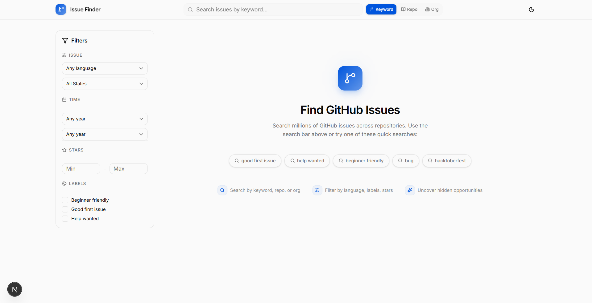
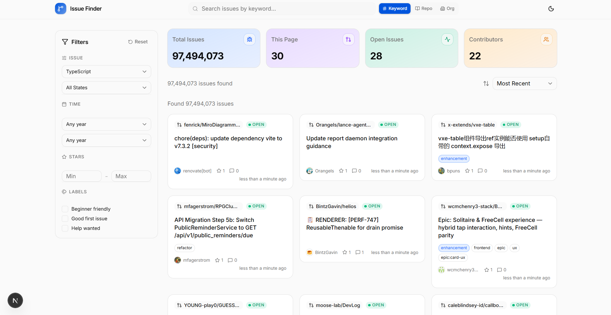

# GitHub Issue Finder

A modern SaaS-style tool to search and filter GitHub issues with powerful filters, sorting, and a clean dashboard UI.

Built with **Next.js 16**, **TypeScript**, **Tailwind CSS v4**, **shadcn/ui**, and **TanStack Query**.



## Features

- **Search** — Search issues by keyword, repository, or organization
- **Filters** — Language, labels, issue state, created/updated year, star range, beginner-friendly, good first issue, help wanted
- **Sorting** — Most recent, most commented, most reactions, repository stars, least competition
- **Dashboard** — Stats overview with per-metric accent colors
- **Issue Cards** — Title, repo, language, labels, stars, date, comments, author, direct GitHub link
- **Dark Mode** — System-aware with manual toggle
- **Responsive** — Mobile sidebar via sheet, desktop sidebar, adaptive grid

## Tech Stack

| Layer | Choice |
|-------|--------|
| Framework | Next.js 16 (App Router) |
| Language | TypeScript |
| Styling | Tailwind CSS v4 |
| UI Library | shadcn/ui (Radix primitives) |
| Icons | Lucide React |
| HTTP | Axios |
| Server State | TanStack Query |
| Fonts | Inter + JetBrains Mono |

## Getting Started

### Prerequisites

- Node.js 18+
- npm / yarn / pnpm / bun

### Installation

```bash
git clone https://github.com/<your-username>/github-issue-finder.git
cd github-issue-finder
npm install
```

### Environment Variables

Create a `.env.local` file in the project root by copying `.env.example`:

```bash
cp .env.example .env.local
```

```env
# GitHub personal access token — increases API rate limit from 60 to 5,000 req/hr
# Generate at: https://github.com/settings/tokens (no scopes needed for public data)
NEXT_PUBLIC_GITHUB_TOKEN=

# --- GitHub OAuth App (Sign-in) ---
# Create at: https://github.com/settings/developers/new
# Homepage URL:           http://localhost:3000
# Authorization callback: http://localhost:3000/api/auth/callback/github
AUTH_GITHUB_ID=
AUTH_GITHUB_SECRET=

# --- Auth.js --- (generate with: npx auth secret)
AUTH_SECRET=
AUTH_URL=http://localhost:3000

# --- Database (Postgres — Neon, Supabase, etc.) ---
# DATABASE_URL = pooled connection (runtime); DIRECT_URL = direct connection (migrations)
DATABASE_URL=
DIRECT_URL=
```

### Database Setup

This app uses **Postgres** via **Prisma** and **NextAuth.js** with a Prisma adapter.

1. Create a free Postgres database at [Neon](https://neon.new) or [Supabase](https://supabase.com)
2. Copy your connection strings into `.env.local`:
   - `DATABASE_URL` — pooled connection (for runtime)
   - `DIRECT_URL` — direct connection (for migrations)
3. Run the migrations:

```bash
npx prisma migrate deploy
npx prisma generate
```

### GitHub Sign-In Setup (OAuth)

1. Go to [GitHub Developer Settings → OAuth Apps](https://github.com/settings/developers) and click **New OAuth App**
2. Fill in:
   - **Application name**: `GitHub Issue Finder (dev)`
   - **Homepage URL**: `http://localhost:3000`
   - **Authorization callback URL**: `http://localhost:3000/api/auth/callback/github`
3. Click **Register application**
4. Copy the **Client ID** and generate a **Client Secret**
5. Paste them into `.env.local` as `AUTH_GITHUB_ID` and `AUTH_GITHUB_SECRET`
6. Generate an Auth.js secret:

```bash
npx auth secret
```

This updates `AUTH_SECRET` in `.env.local`.

Without OAuth, the app runs but saving issues and marking them as done won't work.

### Development

```bash
npm run dev
```

Open [http://localhost:3000](http://localhost:3000).

### Build

```bash
npm run build
npm run lint
```

### Production

```bash
npm start
```

## Project Structure

```
src/
├── app/
│   ├── layout.tsx              # Root layout (fonts, providers, theme script)
│   ├── page.tsx                # Main dashboard
│   └── globals.css             # Tailwind + shadcn + theme variables
├── components/
│   ├── ui/                     # shadcn primitives
│   ├── layout/                 # Navbar, Sidebar
│   ├── issues/                 # IssueCard, IssueList
│   ├── search/                 # SearchBar, FilterPanel, SortDropdown
│   ├── dashboard/              # StatsCards, RecentSearches
│   ├── shared/                 # Pagination, ThemeToggle, Welcome
│   └── providers/              # TanStack Query provider
├── hooks/
│   ├── use-github-search.ts    # TanStack Query hook for GitHub API
│   ├── use-debounce.ts
│   ├── use-local-storage.ts
│   └── use-theme.ts
└── lib/
    ├── github-api.ts           # Axios instance + API functions
    ├── types.ts                # TypeScript interfaces
    ├── constants.ts            # Languages, sort options, years
    └── utils.ts                # cn() helper
```
