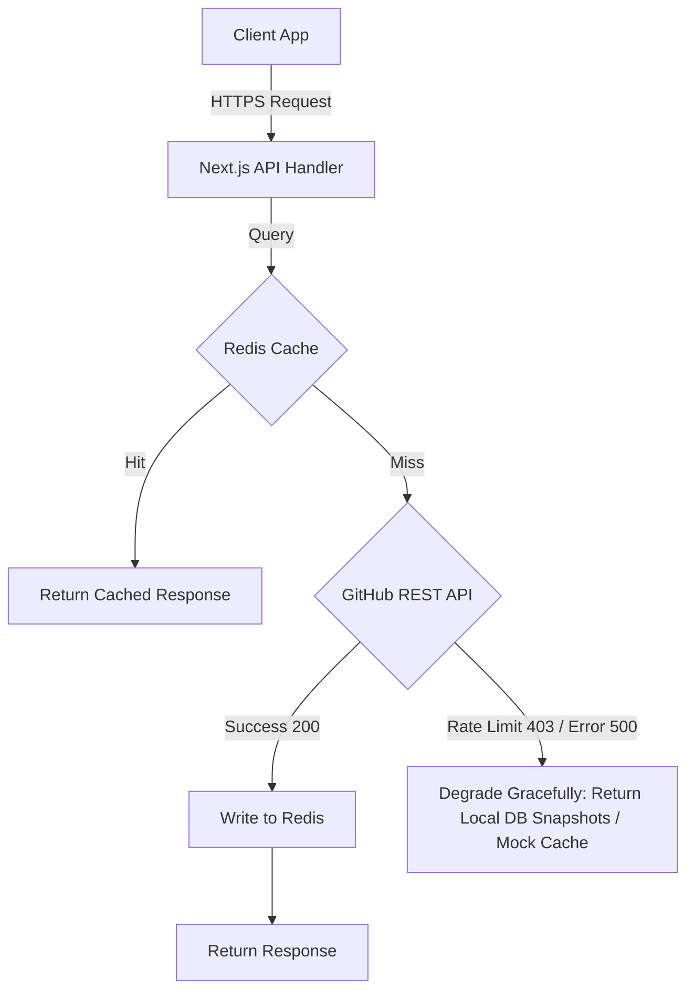

# 🛠️ GitHub Issue Finder — Production-Ready Roadmap & Codebase Audit

This document presents a comprehensive audit of the current **GitHub Issue Finder** codebase alongside a production-ready roadmap. It outlines concrete improvements, architectural patterns, and prioritized action plans to elevate the project from a developer utility to an enterprise-grade SaaS application.

---

## 1. Feature Gap Analysis

### Essential Missing Features
*   **Deep Linking & SEO for Issues (Issue Detail Page)**: Currently, issues are opened inside a modal (`IssueDetailModal`). This prevents users from bookmarking a specific issue, sharing a link directly with a teammate, or benefiting from SEO indexing for search engine discoverability.
*   **Advanced Query Builder**: The current UI supports simple toggles. Enterprise users need full support for complex GitHub search qualifiers (e.g., exclusion filters `exclude:label`, commenter searches, repository size constraints `size:>5000`, and reactions count filtering `reactions:>10`).
*   **Webhook-Driven Sync & Push Notifications**: Currently, issue data is stored as a static snapshot in the database. If an issue is closed on GitHub or receives a critical comment, the local database remains stale until the user manually refreshes or interacts with it.
*   **Collaborative Workspaces**: Developer teams cannot share bookmarked lists of issues, review each other's notes, or collaborate on a shared Kanban board for open-source sprint planning.

### High-Value Competitor Elevators
*   **One-Click IDE Integration**: A button to open any issue or repository directly in **VS Code**, **Cursor**, or **GitHub Codespaces** using custom URI schemes:
    ```
    vscode://vscode.git/clone?url=https://github.com/owner/repo.git
    ```
*   **AI-Powered Semantic Issue Search & Recommendation**: Complementing the GitHub keyword matching with a vector database (e.g., pgvector on Neon) to perform semantic searches on issue descriptions, suggesting issues that match a developer's specific skill level and writing style.
*   **Automated PR Tracking & Kanban Status Sync**: Automatically linking a developer's Pull Request (via GitHub Webhooks or OAuth scope) to their saved issue. When a PR is opened, the Kanban moves the issue to `IN_REVIEW`. When merged, it automatically marks it as `DONE` and moves it to `Completed`.

---

## 2. Enterprise-Grade Enhancements (Production-Level)

### 2.1 Security & Compliance

#### Vulnerability: Storing GitHub Personal Access Tokens (PATs) in LocalStorage
Currently, in [settings-dialog.tsx](file:///c:/laragon/www/github-issue-finder/src/components/layout/settings-dialog.tsx), user-provided PATs are saved directly to `localStorage` under `"github-token"`. If the application suffers an XSS (Cross-Site Scripting) vulnerability, a malicious script can steal these tokens and gain full read/write access to the user's GitHub account.

#### Proposed Solution: Database Encryption & Session Cookies
Store GitHub OAuth access tokens and user-provided PATs encrypted in the database. Provide them to the backend API via HTTP-Only, Secure, SameSite=Strict cookies.

```ts
// src/lib/crypto.ts
import { createCipheriv, createDecipheriv, randomBytes } from "crypto"

const ALGORITHM = "aes-256-gcm"
const ENCRYPTION_KEY = process.env.ENCRYPTION_KEY! // Must be 32 bytes

export function encrypt(text: string): { iv: string; encryptedData: string; tag: string } {
  const iv = randomBytes(16)
  const cipher = createCipheriv(ALGORITHM, Buffer.from(ENCRYPTION_KEY, "hex"), iv)
  let encrypted = cipher.update(text, "utf8", "hex")
  encrypted += cipher.final("hex")
  const tag = cipher.getAuthTag().toString("hex")
  
  return {
    iv: iv.toString("hex"),
    encryptedData: encrypted,
    tag: tag,
  }
}

export function decrypt(encrypted: string, iv: string, tag: string): string {
  const decipher = createDecipheriv(
    ALGORITHM,
    Buffer.from(ENCRYPTION_KEY, "hex"),
    Buffer.from(iv, "hex")
  )
  decipher.setAuthTag(Buffer.from(tag, "hex"))
  let decrypted = decipher.update(encrypted, "hex", "utf8")
  decrypted += decipher.final("utf8")
  return decrypted;
}
```

Implement rate limiting on the Next.js API endpoints (`/api/search/*`) to prevent token exhaustion.

```ts
// src/middleware.ts
import { NextResponse } from "next/server"
import type { NextRequest } from "next/server"
import { Ratelimit } from "@upstash/ratelimit"
import { Redis } from "@upstash/redis"

const ratelimit = new Ratelimit({
  redis: Redis.fromEnv(),
  limiter: Ratelimit.slidingWindow(60, "1 m"), // 60 requests per minute
  analytics: true,
})

export async function middleware(request: NextRequest) {
  if (request.nextUrl.pathname.startsWith("/api/search")) {
    const ip = request.ip ?? "127.0.0.1"
    const { success, limit, reset, remaining } = await ratelimit.limit(ip)
    
    if (!success) {
      return new NextResponse(JSON.stringify({ error: "Rate limit exceeded" }), {
        status: 429,
        headers: {
          "X-RateLimit-Limit": limit.toString(),
          "X-RateLimit-Remaining": remaining.toString(),
          "X-RateLimit-Reset": reset.toString(),
          "Content-Type": "application/json",
        },
      })
    }
  }
  return NextResponse.next()
}
```

---

### 2.2 Scalability & Performance

#### Current Bottleneck: Serverless Custom In-Memory Caching
In [server-cache.ts](file:///c:/laragon/www/github-issue-finder/src/lib/server-cache.ts), a global JavaScript `Map` is used. In serverless deployments (Vercel, AWS Lambda), Next.js routes run in ephemeral container environments. Cold starts wipe out memory caches, and separate concurrent lambdas cannot share caches, resulting in redundant, high-latency calls to GitHub's REST API.

#### Solution: Distributed Redis Caching Layer
Introduce Redis (e.g., Upstash Redis) to synchronize search caches across all serverless function instances.

```ts
// src/lib/redis-cache.ts
import { Redis } from "@upstash/redis"

const redis = Redis.fromEnv()
const CACHE_TTL = 300 // 5 minutes

export async function getCachedSearch<T>(key: string): Promise<T | null> {
  try {
    return await redis.get<T>(key)
  } catch (error) {
    console.error("Redis read error:", error)
    return null
  }
}

export async function setCachedSearch<T>(key: string, data: T): Promise<void> {
  try {
    await redis.set(key, JSON.stringify(data), { ex: CACHE_TTL })
  } catch (error) {
    console.error("Redis write error:", error)
  }
}
```

#### Database Indexing Optimization
In [schema.prisma](file:///c:/laragon/www/github-issue-finder/prisma/schema.prisma), queries on `SavedIssue` require composite filtering and sorting by Kanban state. Add optimized indices:

```prisma
model SavedIssue {
  // ... existing fields ...
  
  @@unique([userId, issueId])
  @@index([userId, status, updatedAt(desc)]) // Fast dashboard Kanban queries
  @@index([userId, done, doneAt(desc)])       // Optimized "Completed" filter queries
}
```

---

### 2.3 Resilience & Fault Tolerance



*   **Axios Retry Policies**: Configure Axios interceptors in `src/lib/github-api.ts` with exponential backoff to handle network glitches or temporary GitHub API throttling.
*   **Graceful Degradation Fallbacks**: If the GitHub API limit is exhausted, display a clear warning banner and fall back to searching issues saved locally in the PostgreSQL database instead of throwing a generic error screen.

---

## 3. Code Quality & Architecture

### 3.1 Breaking Clean Architecture (SOLID)
Currently, Next.js API Routes directly couple business logic, API requests, Zod schemas, and database calls in a single handler file (e.g., [saved-issues/route.ts](file:///c:/laragon/www/github-issue-finder/src/app/api/saved-issues/route.ts)).

To make the code modular, testable, and maintainable, introduce the **Service / Repository Pattern**.

```
src/
├── app/api/saved-issues/route.ts  ← HTTP Route Controller (Zod Validation, Auth verification)
├── services/
│   └── saved-issues.service.ts    ← Business Rules (Sync done/saved state, timestamps)
└── repositories/
    └── saved-issues.repository.ts ← Database Adapter (Direct Prisma operations)
```

#### Refactoring Example: Decoupled Database Layer
```ts
// src/repositories/saved-issues.repository.ts
import { prisma } from "@/lib/prisma"
import type { Prisma } from "@prisma/client"

export class SavedIssuesRepository {
  static async findByUserAndIssue(userId: string, issueId: bigint) {
    return prisma.savedIssue.findUnique({
      where: { userId_issueId: { userId, issueId } },
    })
  }

  static async upsertIssue(
    userId: string,
    issueId: bigint,
    createData: Prisma.SavedIssueCreateWithoutUserInput,
    updateData: Prisma.SavedIssueUpdateWithoutUserInput
  ) {
    return prisma.savedIssue.upsert({
      where: { userId_issueId: { userId, issueId } },
      create: { userId, issueId, ...createData },
      update: updateData,
    })
  }
}
```

### 3.2 Environment Typing & Validation
Currently, environment variables are read dynamically using `process.env.VARIABLE`, which can fail silently at runtime. Build a strict validation module that runs during the build step and initial runtime loading:

```ts
// src/lib/env.ts
import { z } from "zod"

const envSchema = z.object({
  DATABASE_URL: z.string().url(),
  DIRECT_URL: z.string().url(),
  AUTH_SECRET: z.string().min(10),
  AUTH_GITHUB_ID: z.string(),
  AUTH_GITHUB_SECRET: z.string(),
  ENCRYPTION_KEY: z.string().length(64), // Hex-encoded 32-byte key
  GITHUB_TOKEN: z.string().optional(),
})

const parsed = envSchema.safeParse(process.env)

if (!parsed.success) {
  console.error("❌ Invalid environment configuration:", parsed.error.format())
  throw new Error("Invalid environment configuration")
}

export const env = parsed.data
```

---

## 4. DevOps, CI/CD, & Observability

### 4.1 Cloud-Native Deployment & Infrastructure
Containerize the Next.js application using multi-stage Docker builds to ensure reproducible, secure, and production-optimized builds across any environment.

```dockerfile
# Dockerfile
# Stage 1: Dependencies
FROM node:20-alpine AS deps
WORKDIR /app
COPY package*.json ./
RUN npm ci

# Stage 2: Builder
FROM node:20-alpine AS builder
WORKDIR /app
COPY --from=deps /app/node_modules ./node_modules
COPY . .
ENV NEXT_TELEMETRY_DISABLED=1
RUN npx prisma generate
RUN npm run build

# Stage 3: Runner
FROM node:20-alpine AS runner
WORKDIR /app
ENV NODE_ENV=production
RUN addgroup --system --gid 1001 nodejs
RUN adduser --system --uid 1001 nextjs
COPY --from=builder /app/public ./public
COPY --from=builder --chown=nextjs:nodejs /app/.next ./.next
COPY --from=builder /app/node_modules ./node_modules
COPY --from=builder /app/package.json ./package.json
COPY --from=builder /app/prisma ./prisma
USER nextjs
EXPOSE 3000
CMD ["npm", "start"]
```

### 4.2 Observability & Monitoring
*   **Structured Logging**: Replace simple `console.error` with a structured logger (`pino` or `winston`) exporting JSON logs to standard output. This allows cloud monitoring aggregators (e.g., Datadog, Logstash) to index search keywords, query latencies, and API error codes.
*   **Real-time Error Tracking**: Integrate Sentry inside `instrumentation.ts` to capture client-side React rendering failures and server-side route errors.
*   **APM Metrics (OpenTelemetry)**: Instrument Prisma queries and outgoing GitHub HTTP requests to monitor the time spent in the database vs. time spent waiting on external APIs.

### 4.3 Testing Architecture Plan

```
Tests/
├── unit/
│   ├── hooks/          ← Custom hooks (useDebounce, useHotkey)
│   └── lib/            ← Helper utilities (URL parsers, query formatters)
├── integration/
│   ├── api/            ← Mocking next-auth and DB to test API endpoints
│   └── database/       ← Testing index hit performance & schema operations
└── e2e/
    └── search.spec.ts  ← Playwright workflows (Sign In -> Search -> Save -> Move on Kanban)
```

*   **Unit & Component Testing**: Maintain **Jest** & **React Testing Library** for frontend component rendering, theme toggling, and query parameters construction.
*   **End-to-End Testing**: Introduce **Playwright** to test full application integrations. Mocking GitHub's OAuth callback will allow tests to verify login workflows, issue bookmarking, and Kanban drag-and-drop state updates.

---

## 5. Prioritized Initiative Roadmap

This grid organizes the suggested roadmap enhancements by business value / impact and implementation complexity / effort.

| Initiative | Category | Impact | Effort | Priority |
| :--- | :--- | :--- | :--- | :--- |
| **Upstash Redis Caching** | Performance | **High** | Medium | 🔥 **P0** (Critical) |
| **Strict Env Validation (Zod)** | Code Quality | **Medium** | Low | 🔥 **P0** (Critical) |
| **Secure Token Storage (Crypto)**| Security | **High** | Medium | 🚀 **P1** (High) |
| **Axios Retries & Fallbacks** | Resilience | **High** | Low | 🚀 **P1** (High) |
| **Structured Logging (Pino)** | DevOps | **Medium** | Low | 🚀 **P1** (High) |
| **Dockerization & CI Pipelines**| DevOps | **Medium** | Medium | 📅 **P2** (Medium) |
| **Service/Repository Decoupling**| Code Quality | **Medium** | High | 📅 **P2** (Medium) |
| **Playwright E2E Testing** | QA | **High** | High | 📅 **P2** (Medium) |
| **Issue Details Page & SEO** | Features | **High** | Medium | 📅 **P2** (Medium) |
| **AI Semantic Search (pgvector)**| Features | **Medium** | High | ⏳ **P3** (Low) |
| **Collaborative Workspaces** | Features | **High** | High | ⏳ **P3** (Low) |

---

## 6. Next Steps & Recommended Actions

1.  **Immediate Step (P0)**: Define the Zod schema validation for environment variables to prevent misconfigurations in development or production.
2.  **Infrastructure (P0-P1)**: Spin up an Upstash Redis store, configure the env parameters, and replace the in-memory cache helper.
3.  **Refactoring (P2)**: Migrate core data writing calls inside `/api/saved-issues` to a repository layer, making it unit-testable.
